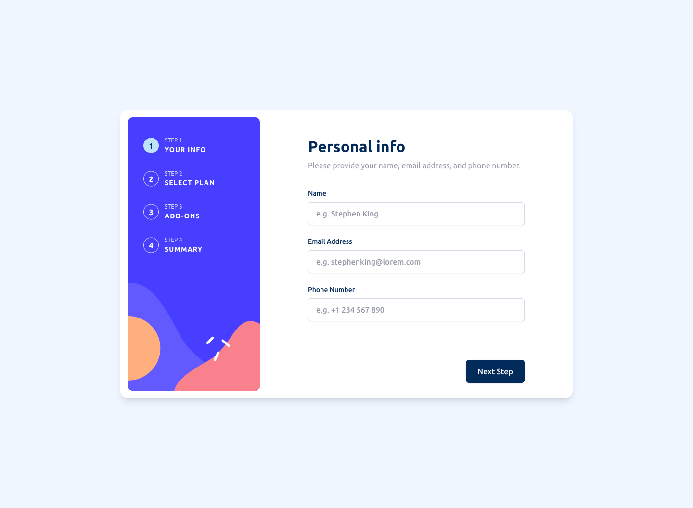

# Frontend Mentor - Multi-step form solution

This is a solution to the [Multi-step form challenge on Frontend Mentor](https://www.frontendmentor.io/challenges/multistep-form-YVAnSdqQBJ). Frontend Mentor challenges help you improve your coding skills by building realistic projects.

## Table of contents

- [Overview](#overview)
  - [The challenge](#the-challenge)
  - [Screenshot](#screenshot)
  - [Links](#links)
- [My process](#my-process)
  - [Built with](#built-with)
  - [Continued development](#continued-development)
  - [Useful resources](#useful-resources)
- [Author](#author)

## Overview

### The challenge

Users should be able to:

- Complete each step of the sequence
- Go back to a previous step to update their selections
- See a summary of their selections on the final step and confirm their order
- View the optimal layout for the interface depending on their device's screen size
- See hover and focus states for all interactive elements on the page
- Receive form validation messages if:
  - A field has been missed
  - The email address is not formatted correctly
  - A step is submitted, but no selection has been made

### Screenshot

### Links

- [Live Site](https://fm-multi-step-form.vercel.app/)

## My process

### Built with

- Semantic HTML5 markup
- CSS custom properties
- Flexbox
- CSS Grid
- Typescript
- [React](https://reactjs.org/) - JS library
- [Next.js](https://nextjs.org/) - React framework
- [React Hook Form](https://www.react-hook-form.com/) - Performant, flexible and extensible forms with easy-to-use validation.
- [Zod](https://zod.dev/) - TypeScript-first schema validation with static type inference
- [Tailwindcss](https://tailwindcss.com/) - For styles

### Continued development

Although was not required, I might add later on back-end validation and will send confirmation email using Next.js server action.

### Useful resources

- [React Hook Form - API Docs](https://www.react-hook-form.com/api/) - This helped me to fine tune validation and form behavior.
- [Tailwindcss - Docs](https://tailwindcss.com/docs/) - This helped me to find how to config Tailwindcss and how to use arbitrary values when needed.

## Author

I'm a designer that also has front-end development skills you can check out my work at:

- My Portfolio - [Behance](https://www.behance.net/eyalp)
